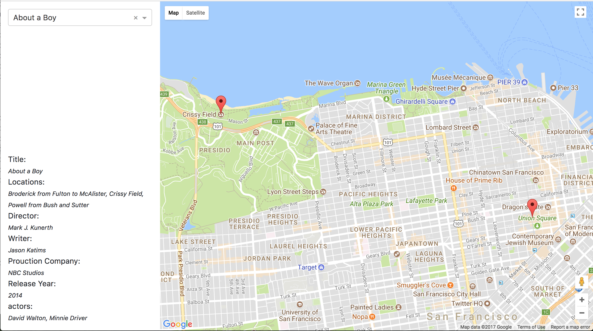

# SF Movies

This app shows a map of San Francisco with markers denoting places a film is filmed at. This is how it works:

- When the app is loaded, it will display a map on the right and a search box on the left.
- When user selected a movie, left side will show a bunch of texts showing the information of the movie such as title, release year, production company, director, writer, actor1,2,3, and locations.
- If user type an invalid movie name, markers on the map will be removed and there will not be autocompletion.

## Components

### `<App />`

This top level component controls the state of the whole application. It:

- load all the movies into a local state when a app is mounted
- find the `currentMovie` and `positions` which will be used by `MovieInfo` and `MovieLocationMap` component respectively.

### `<MovieInfo />`

**props:**

- `currentMovie` {Object}: a movie object with `title`, `release_year`, `production_company`, `director`, `writer`, `actor_1,2,3` and `locations`

### `<MovieLocationMap />`

**Props:**

- `positions` (Array<LatLngLiteral>): an array of [LatLngLiteral](https://developers.google.com/maps/documentation/javascript/3.exp/reference#LatLngLiteral) that are used to display markers on the map

## Security

According to [this post](https://stackoverflow.com/a/39625963/2599541), google map api key has to be public on web source code, so I've restricted my API key to be used by only this app's address.

## Architecture

This is a serverless web app hosted on Netlify.

- SF movie data are retrived from [here](https://data.sfgov.org/resource/wwmu-gmzc.json) with an ajax call
- Location names will be turned into latitude and longitude via [Geocoding API](https://developers.google.com/maps/documentation/geocoding/intro) (also done by ajax call)

## Libraries

- [react-google-maps](https://tomchentw.github.io/react-google-maps/#introduction)
- [lodash](https://lodash.com/docs/4.17.4)
- [bootstrap](https://getbootstrap.com/)
- [reactstrap](https://reactstrap.github.io/)
- [superagent](https://github.com/visionmedia/superagent)
- [react-select](https://github.com/JedWatson/react-select)

## Screenshot

## Change Log

### v1.0.0 - 20171213 (@jerry)
* Able to show where various movies are filmed.
